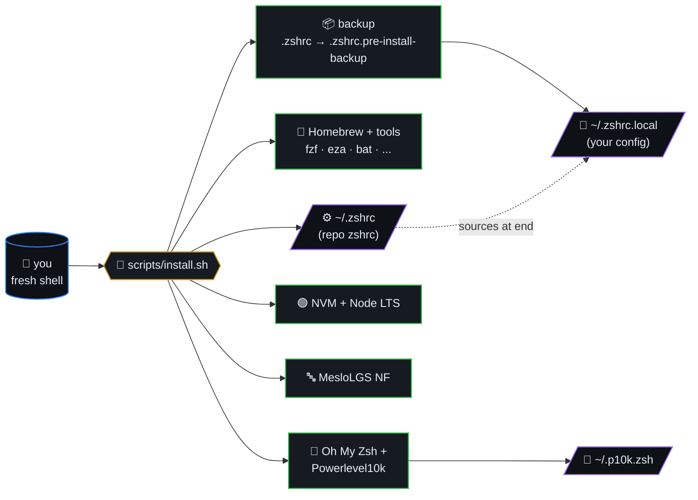
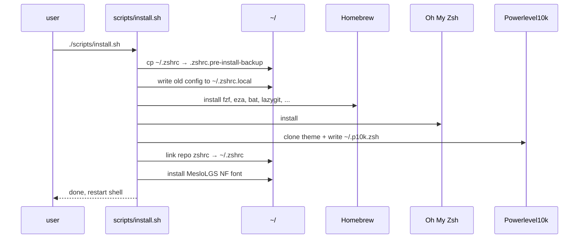
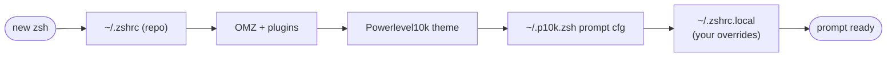

# Zsh Configuration with Powerlevel10k

> One-command setup for a complete macOS/Linux terminal: Oh My Zsh,
> Powerlevel10k, fzf, eza, bat, lazygit, thefuck, and more.

**Your existing `~/.zshrc` is preserved** — the installer backs it up and migrates your config to `~/.zshrc.local` (sourced at the end), so nothing is lost.



## Table of contents

- [Quick Start](#quick-start)
- [Install pipeline (sequence)](#install-pipeline-sequence)
- [Shell startup order](#shell-startup-order)
- [What Gets Installed](#what-gets-installed)
- [How It Works](#how-it-works)
- [Font Setup](#font-setup)
- [Commands & Aliases](#commands--aliases)
- [Configuration](#configuration)
- [Updating](#updating)
- [Uninstalling](#uninstalling)
- [Testing](#testing)
- [File Structure](#file-structure)
- [Troubleshooting](#troubleshooting)
- [License](#license)
- [Author](#author)

## Install pipeline (sequence)



## Shell startup order



## Quick Start

```bash
git clone https://github.com/ml-lubich/zshrc.git
cd zshrc
./scripts/install.sh
exec zsh
```

Then set your terminal font to **MesloLGS NF** (see [Font Setup](#font-setup)).

That's it. See [QUICKSTART.md](QUICKSTART.md) for the even shorter version.

## What Gets Installed

| Category | Tools |
|----------|-------|
| **Shell** | Oh My Zsh, Powerlevel10k, zsh-autosuggestions, zsh-syntax-highlighting |
| **Search** | fzf, ripgrep, fd |
| **Modern CLI** | eza (ls), bat (cat), thefuck (typo fix), lazygit (git TUI), autojump |
| **Runtime** | NVM + Node.js LTS, Python (latest) |
| **Fonts** | MesloLGS NF (all 4 variants) |
| **macOS extras** | Homebrew, Xcode CLI Tools, iTerm2 (optional) |

All tools are guarded with `command -v` checks — if a tool isn't installed, its aliases are silently skipped.

## How It Works

1. **Backup** — `~/.zshrc` → `~/.zshrc.pre-install-backup`
2. **Preserve** — your existing config → `~/.zshrc.local` (bare `source` lines auto-guarded with `[ -f ] &&`)
3. **Install** — Homebrew packages, Oh My Zsh, Powerlevel10k, fonts, NVM
4. **Write** — repo `zshrc` → `~/.zshrc` (includes all tool configs with guards)
5. **Source** — `~/.zshrc.local` is sourced at the end, so your settings override ours

**Result:** Our tools + your config. Nothing is lost.

## Font Setup

The installer downloads MesloLGS NF automatically. You just need to tell your terminal to use it:

| App | Where to set it |
|-----|----------------|
| **Terminal.app** | Preferences → Profiles → Text → Font → `MesloLGS NF` |
| **iTerm2** | Preferences → Profiles → Text → Font → `MesloLGS NF` |
| **VS Code / Cursor** | Settings → search "terminal font" → set `terminal.integrated.fontFamily` to `MesloLGS NF` |
| **Linux (GNOME)** | Edit → Preferences → Profile → Custom font → `MesloLGS NF` |

Then restart your terminal.

## Commands & Aliases

| Command | What it does |
|---------|-------------|
| `ls` / `ll` / `tree` | eza with icons + git status |
| `cat` | bat with syntax highlighting |
| `f` / `fuck` | Fix last command typo |
| `lg` | lazygit |
| `ff` | fzf file finder with bat preview |
| `rgg "term"` | ripgrep + fzf + bat preview |
| `Ctrl+R` | Fuzzy search command history |
| `Ctrl+T` | Fuzzy insert file path |
| `mygit` | Go to `~/dev` |
| `mygit project` | Go to `~/dev/project` and open in editor |
| `mygit -n project` | Create new project and open in editor |
| `gs` / `ga` / `gc` / `gp` | git status / add . / commit / push |

Customize `mygit` with `MYGIT_PROJECTS_DIR` and `MYGIT_EDITOR` env vars.

## Configuration

### Install options

Set env vars before running install, or edit [scripts/config.sh](scripts/config.sh):

```bash
PYTHON_VERSION=3.12 NODE_VERSION=20 INSTALL_ITERM2=false ./scripts/install.sh
```

All options: `PYTHON_VERSION`, `NODE_VERSION`, `INSTALL_ITERM2`, `INSTALL_XCODE_TOOLS`, `INSTALL_FONTS`, `INSTALL_DEV_TOOLS`, `INSTALL_OH_MY_ZSH`, `INSTALL_POWERLEVEL10K`, `INSTALL_NVM`, `SET_DEFAULT_SHELL`, `BACKUP_EXISTING`.

### Files

| File | Purpose | Overwritten on install? |
|------|---------|------------------------|
| `~/.zshrc` | Our tools + config | Yes |
| `~/.zshrc.local` | Your machine-specific config | **Never** |
| `~/.p10k.zsh` | Powerlevel10k theme | Only if missing |
| `~/.zshrc.pre-install-backup` | Your original zshrc | Only on first run |

### Customizing

- **Prompt:** `p10k configure`
- **Your paths/aliases:** Edit `~/.zshrc.local`
- **Plugins:** Edit the `plugins=(...)` array in `~/.zshrc`

## Updating

```bash
cd zshrc && git pull && ./scripts/install.sh
```

Idempotent — safe to run repeatedly.

## Uninstalling

```bash
./scripts/uninstall.sh
```

Asks for confirmation before removing each component. Restores backups.

## Testing

```bash
pip install -r requirements.txt
pytest
```

79 tests covering script syntax, safety, idempotency, portability, and correctness.

## File Structure

```
zshrc/
├── zshrc                  # Main shell config → ~/.zshrc
├── config/p10k.zsh        # Powerlevel10k theme → ~/.p10k.zsh
├── scripts/
│   ├── install.sh         # Idempotent installer
│   ├── uninstall.sh       # Uninstaller (with confirmations)
│   └── config.sh          # Install options
├── tests/                 # 79 pytest tests
├── docs/                  # Architecture, design, API docs
├── QUICKSTART.md          # 4-step quick start
└── README.md              # This file
```

## Troubleshooting

| Problem | Fix |
|---------|-----|
| Icons show as boxes | Set terminal font to `MesloLGS NF`, restart terminal |
| Command not found | Run `source ~/.zshrc` or restart terminal |
| Restore old config | `cp ~/.zshrc.pre-install-backup ~/.zshrc` |
| P10k prompt missing | Check `~/.p10k.zsh` exists, run `p10k configure` |
| Syntax errors | `zsh -n ~/.zshrc` to check |

## License

Personal use. Fork and customize for your own needs.

## Author

**Misha Lubich** — [@ml-lubich](https://github.com/ml-lubich)
